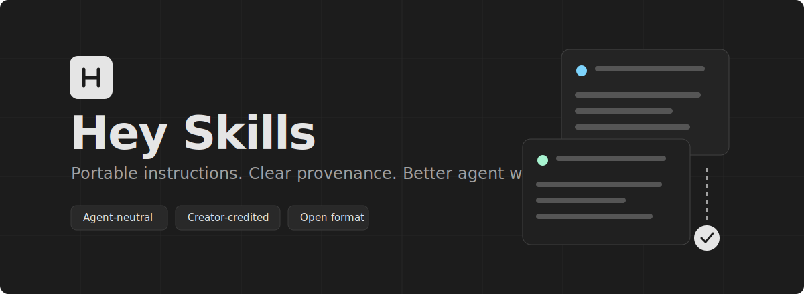
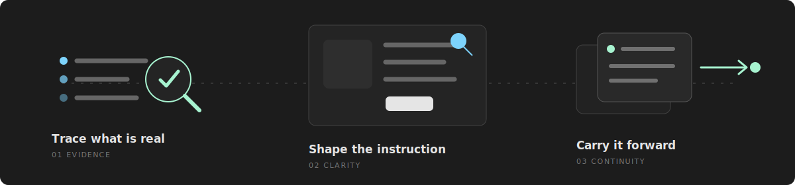

<p align="center">
  
</p>

<p align="center">
  A personal library of reusable skills for capable agents.<br>
  Browse what you need, then install one skill or the complete collection.
</p>

<p align="center">
  <a href="SKILLS.md"><strong>Browse skills</strong></a> ·
  <a href="https://github.com/Elvis020/hey-skills/archive/refs/heads/main.zip">Download all</a> ·
  <a href="ATTRIBUTION.md">Credits</a>
</p>

<p align="center">
  
</p>

<p align="center"><em>Evidence in. Clear instructions out. Useful context carried forward.</em></p>

## Take what you need

One skill:

```sh
npx github:Elvis020/hey-skills add logging-best-practices --to ./skills
```

The whole shelf:

```sh
npx github:Elvis020/hey-skills add --all --to ./skills
```

`--to` chooses the destination, so the same collection works with any agent that reads skill folders.
