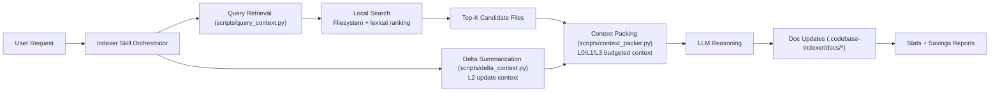
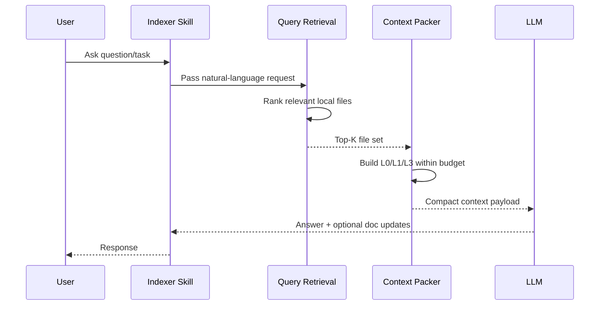

# Codebase Indexer Overview (Local Only)

Inspiration reference: [@joshtriedcoding on X](https://x.com/joshtriedcoding/status/2042535715712516284?s=20)

## System Diagram (Current Implementation)



Plain-text fallback:

```text
User Request
  -> Indexer Skill Orchestrator
    -> Query Retrieval (scripts/query_context.py)
      -> Local Search (filesystem + lexical ranking)
        -> Top-K Candidate Files
          -> Context Packing (scripts/context_packer.py, L0/L1/L3)
    -> Delta Summarization (scripts/delta_context.py, L2 updates)
      -> Context Packing
        -> LLM Reasoning
          -> Doc Updates (.codebase-indexer/docs/*)
            -> Stats + Savings Reports
```

## Request Flow (Current Implementation)



Plain-text fallback:

```text
1) User asks question/task
2) Skill passes query to retrieval
3) Retrieval ranks relevant local files
4) Top-K files go to context packer
5) Packer builds budgeted L0/L1/L3 context
6) LLM answers using compact context
7) Skill returns response and may update docs
```

## What This Guarantees

- No manual search bar required.
- No Redis dependency.
- Token savings from automatic file selection + tiered packing.
