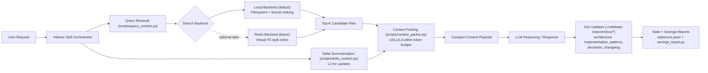
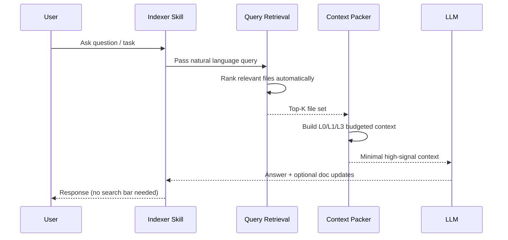

# Codebase Indexer Overview

Inspiration reference: [@joshtriedcoding on X](https://x.com/joshtriedcoding/status/2042535715712516284?s=20)

## Big Picture



Plain-text fallback:

```text
User Request
  -> Indexer Skill Orchestrator
    -> Query Retrieval (scripts/query_context.py)
      -> Search Backend
        -> Local Backend (default)
        -> Redis Backend (optional future)
      -> Top-K Candidate Files
        -> Context Packing (scripts/context_packer.py, L0/L1/L3)
    -> Delta Summarization (scripts/delta_context.py, L2 updates)
      -> Context Packing
        -> Compact Context Payload
          -> LLM Reasoning / Response
            -> Doc Updates (.codebase-indexer/docs/*)
              -> Stats + Savings Reports
```

## Request Flow (No Manual Search UI)



Plain-text fallback:

```text
1) User asks question/task
2) Skill forwards natural-language query
3) Retrieval ranks files automatically
4) Top-K files are packed into budgeted context
5) LLM responds from compact high-signal context
6) Skill returns answer and optionally updates docs
```

## Why This Helps

- Reduces token usage by sending only high-relevance file slices.
- Keeps retrieval invisible to the user (prompt-driven, not UI-driven).
- Supports incremental scale: local backend now, optional virtual-FS backend later, same calling contract.
